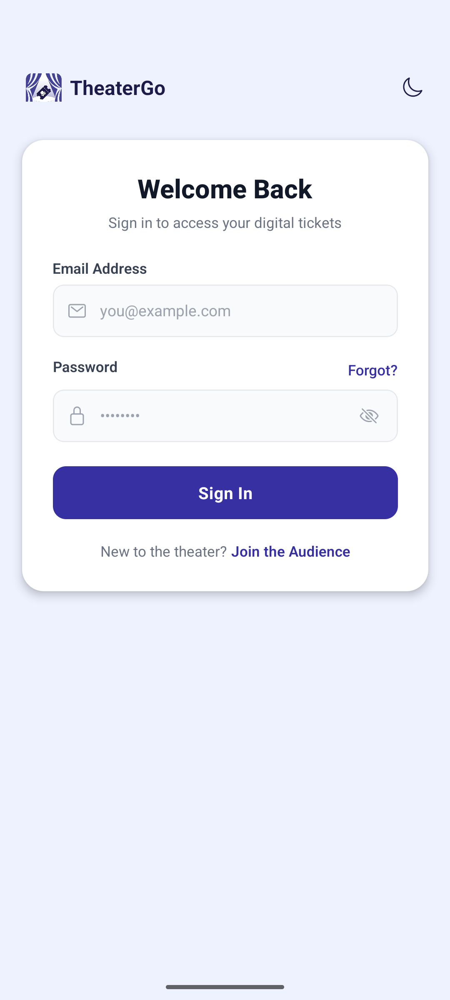
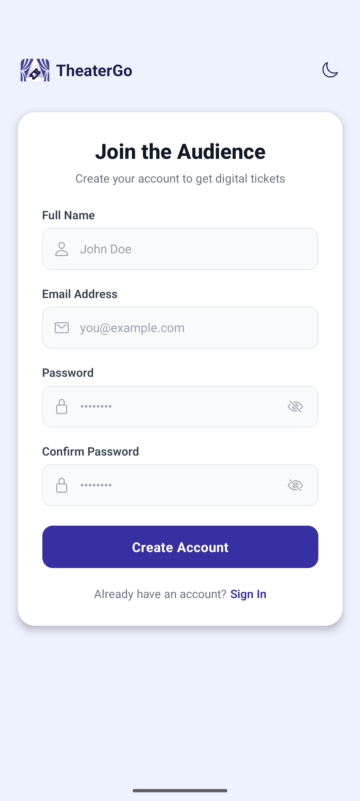
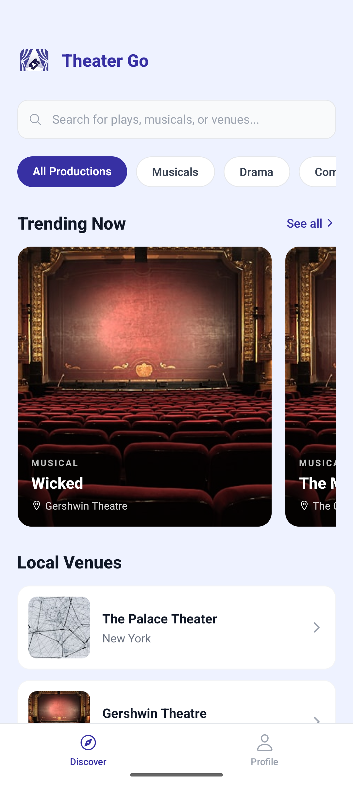
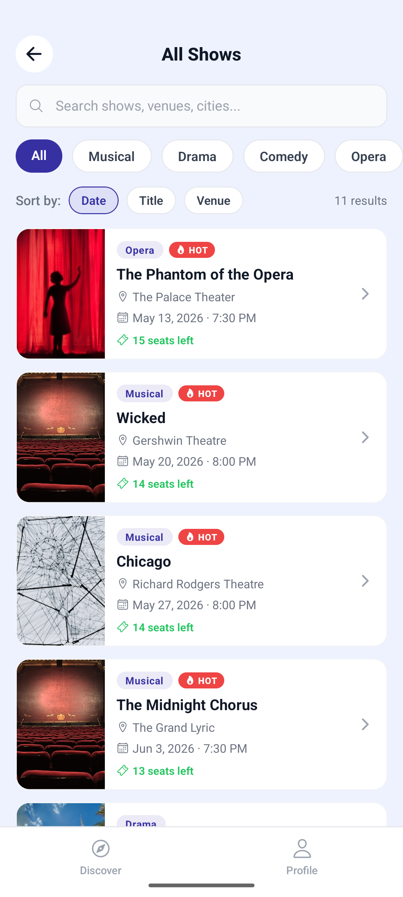
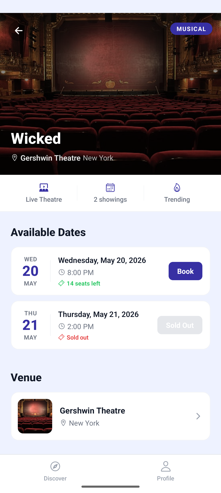
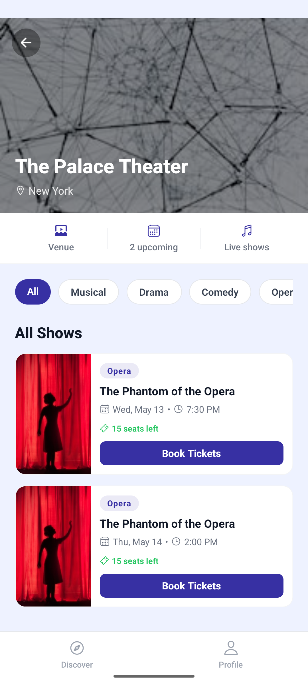
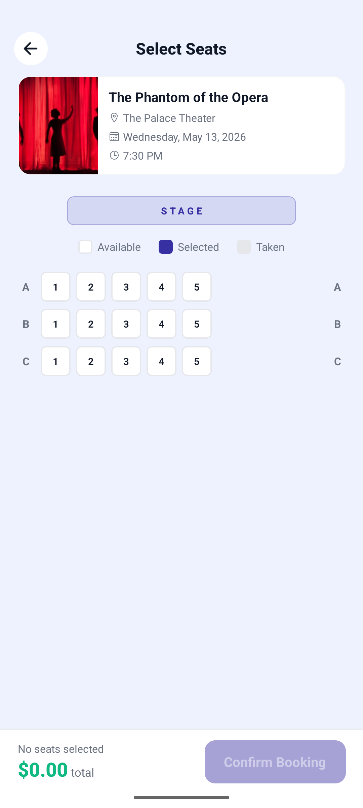
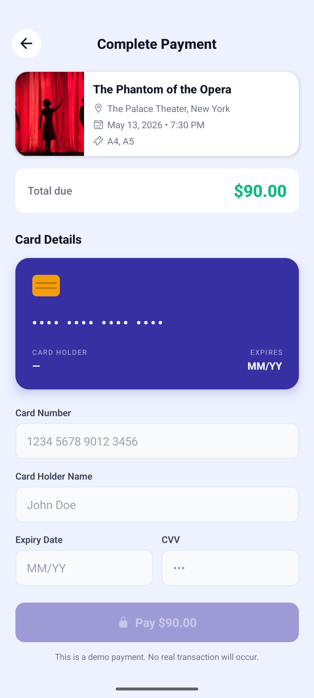
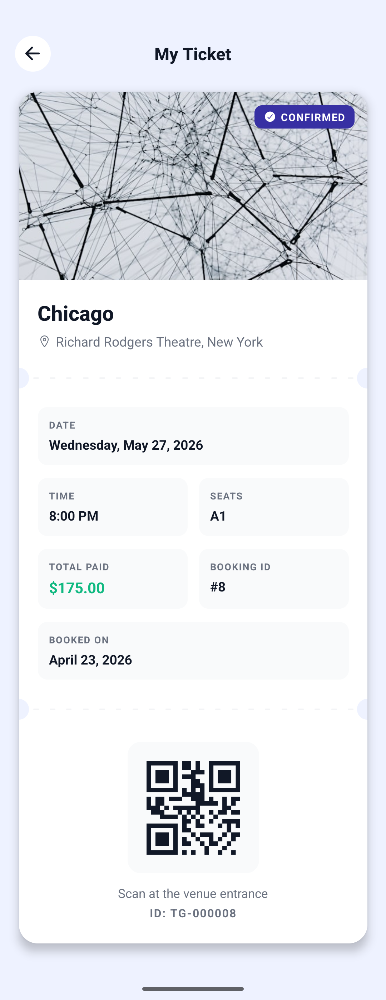
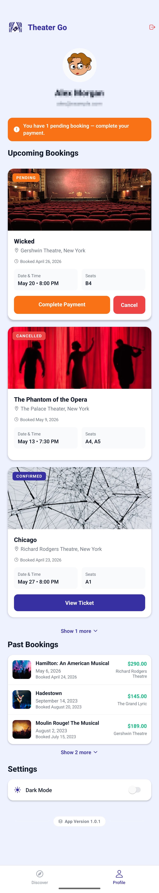

<div align="center">

# TheaterGo 

</div>
A theater ticket booking application for Android/iOS, built with **React Native (Expo)** on the frontend and **Node.js / Express** on the backend, backed by a **MariaDB** database.

---

## Table of Contents

1. [Application Overview](#application-overview)
2. [System Architecture](#system-architecture)
3. [Technologies & Tools](#technologies--tools)
4. [Project Structure](#project-structure)
5. [Database](#database)
6. [Backend API](#backend-api)
7. [Frontend](#frontend)
8. [Security](#security)
9. [Installation & Setup](#installation--setup)
10. [Environment Variables](#environment-variables)
11. [Testing the API with Postman](#testing-the-api-with-postman)

---

## Application Overview

**TheaterGo** is a mobile application that allows users to:

- **Register and log in** with email and password (JWT authentication).
- **Discover** productions and theaters with search and genre filtering.
- **View details** of each production: venue, available showtimes, prices, and seats.
- **Book** specific seats for a show.
- **Pay** within the app (simulated payment).
- **Manage their bookings** (view, cancel, confirm) from their profile.
- **Display a digital ticket** with a QR code for use at the theater entrance.


---

## System Architecture

```
┌─────────────────────────────────┐
│      React Native (Expo)        │
│         Frontend App            │
│  - Screens / Navigation State   │
│  - ThemeContext (Dark/Light)    │
│  - authFetch (JWT wrapper)      │
└──────────────┬──────────────────┘
               │ HTTP REST (JSON)
               │ Bearer JWT Token
┌──────────────▼──────────────────┐
│      Node.js / Express          │
│         Backend API             │
│  - Routes: auth / shows /       │
│            bookings             │
│  - JWT Middleware               │
│  - Helmet / CORS / Morgan       │
└──────────────┬──────────────────┘
               │ Connection Pool
               │ (mariadb driver)
┌──────────────▼──────────────────┐
│           MariaDB               │
│        theater_go DB            │
│  - users / venues / productions │
│  - shows / seats / bookings /   │
│    booking_seats                │
└─────────────────────────────────┘
```

---

## Technologies & Tools

| Layer | Technology |
|-------|-----------|
| Frontend | React Native |
| Frontend Runtime | Expo |
| Backend | Node.js + Express |
| Database | MariaDB |
| Auth | JSON Web Tokens (JWT) |
| Password Hashing | bcrypt |
| DB Driver | mariadb (npm) |
| Security Headers | Helmet |
| HTTP Logging | Morgan |
| Token Storage | AsyncStorage |
| QR Code | react-native-qrcode-svg |
| API Testing | Postman |
| Version Control | GitHub |

---

## Project Structure

```
FirstProject/
├── backend/
│   ├── index.js                # Entry point, Express setup, routes mount
│   ├── package.json
│   ├── database/
│   │   ├── index.js            # MariaDB connection pool
│   │   ├── schema.sql          # DDL — table definitions
│   │   └── seed.sql            # Initial seed data
│   ├── middleware/
│   │   └── auth.js             # JWT authenticate() middleware + signToken()
│   ├── routes/
│   │   ├── auth.js             # /api/auth/register, /api/auth/login
│   │   ├── shows.js            # /api/shows, /api/shows/:id/seats
│   │   └── bookings.js         # /api/bookings (CRUD)
│   └── utils/
│       └── user.js             # userAlreadyExists() helper
│
└── frontend/
    ├── App.js                  # Navigation state machine, token auto-load
    ├── package.json
    ├── index.js
    ├── app.json
    ├── context/
    │   └── ThemeContext.js     # Dark/Light mode provider + useTheme() hook
    ├── theme/
    │   └── colors.js           # Color palettes for dark & light mode
    ├── utils/
    │   └── authFetch.js        # Authenticated fetch wrapper, auto-logout
    └── screens/
        ├── LoginScreen.js
        ├── RegisterScreen.js
        ├── DiscoverScreen.js
        ├── AllShowsScreen.js
        ├── ShowScreen.js
        ├── VenueScreen.js
        ├── BookScreen.js
        ├── PaymentScreen.js
        ├── TicketScreen.js
        └── ProfileScreen.js
```

---

## Database

**Database:** `theater_go`

### Entity Relationship Diagram (ERD)

```
users
  id (PK) | name | email (UNIQUE) | password | register_date

venues
  id (PK) | name | address | city | rating | genre | image_url | created_at

productions
  id (PK) | title | genre | venue_id (FK→venues) | description | image_url | is_trending | created_at

shows
  id (PK) | production_id (FK→productions) | show_date | show_time | price_per_seat | created_at

seats
  id (PK) | show_id (FK→shows) | row_label | seat_number
  UNIQUE (show_id, row_label, seat_number)

bookings
  id (PK) | user_id (FK→users) | show_id (FK→shows) | total_price | status | booked_at
  status: confirmed | pending | cancelled

booking_seats
  booking_id (FK→bookings) | seat_id (FK→seats)
  PRIMARY KEY (booking_id, seat_id)
```

### Relationships

- A **venue** has many **productions**.
- A **production** has many **shows** (showtimes).
- A **show** has many **seats**.
- A **user** has many **bookings**.
- A **booking** is linked to specific **seats** via **booking_seats**.

---

## Backend API

The server runs on **`http://localhost:5000`**.

> Protected endpoints require the following header:  
> `Authorization: Bearer <JWT_TOKEN>`

### Auth Endpoints

| Method | Endpoint | Auth | Description |
|--------|----------|------|-------------|
| `POST` | `/api/auth/register` | ❌ | Register a new user |
| `POST` | `/api/auth/login` | ❌ | Login and receive a JWT |

**POST /api/auth/register**
```json
// Request Body
{ "name": "John", "email": "user@example.com", "password": "secret123" }

// Response 201
{ "message": "User registered successfully", "token": "<JWT>" }
```

**POST /api/auth/login**
```json
// Request Body
{ "email": "user@example.com", "password": "secret123" }

// Response 200
{ "message": "Login successful", "token": "<JWT>" }
```

---

### Shows Endpoints

| Method | Endpoint | Auth | Description |
|--------|----------|------|-------------|
| `GET` | `/api/shows` | ✅ | List of upcoming shows with available seats |
| `GET` | `/api/shows/:show_id/seats` | ✅ | Seat layout for a specific show with booking status |

**GET /api/shows** — Example response:
```json
[
  {
    "show_id": 1,
    "show_date": "2026-06-15",
    "show_time": "20:00:00",
    "title": "Hamlet",
    "genre": "Drama",
    "image_url": "https://...",
    "is_trending": 1,
    "venue_name": "National Theatre",
    "city": "Athens",
    "available_seats": 42,
    "price": "25.00"
  }
]
```

**GET /api/shows/:show_id/seats** — Example response:
```json
[
  { "id": 1, "row_label": "A", "seat_number": 1, "is_booked": 0 },
  { "id": 2, "row_label": "A", "seat_number": 2, "is_booked": 1 }
]
```

---

### Bookings Endpoints

| Method | Endpoint | Auth | Description |
|--------|----------|------|-------------|
| `POST` | `/api/bookings` | ✅ | Create a new booking |
| `GET` | `/api/bookings/upcoming` | ✅ | Upcoming bookings for the authenticated user |
| `GET` | `/api/bookings/past` | ✅ | Past bookings for the authenticated user |
| `PATCH` | `/api/bookings/:id/cancel` | ✅ | Cancel a booking (pending only) |
| `PATCH` | `/api/bookings/:id/confirm` | ✅ | Confirm a booking (payment) |

**POST /api/bookings**
```json
// Request Body
{ "show_id": 1, "seat_ids": [3, 4, 5] }

// Response 201
{ "booking_id": 12, "total_price": "75.00", "status": "pending" }
```

**GET /api/bookings/upcoming** — Response includes:  
`booking_id`, `title`, `image_url`, `venue_name`, `city`, `total_price`, `status`, `booked_at`, `show_date`, `show_time`, `seats`

---

## Frontend

### Navigation

The app uses a **state machine navigation** pattern inside `App.js` (no external navigation library). Each screen receives callbacks to transition to other screens.

```
Login ──────► Discover ──► AllShows ──► Show ──► Book ──► Payment ──► Ticket
  │               │                      │
Register        Profile               Venue
```

### Screens

| Screen | Description |
|--------|-------------|
| `LoginScreen` | Email/password login, show/hide password toggle |
| `RegisterScreen` | Registration with validation (all fields required, ≥6 chars, password confirmation) |
| `DiscoverScreen` | Home screen: search bar, genre categories, trending productions, local venues |
| `AllShowsScreen` | Full show list with search, genre filter, sort options, and skeleton loading |
| `ShowScreen` | Production details, available showtimes, link to venue |
| `VenueScreen` | Venue info and its associated productions |
| `BookScreen` | Seat grid, seat selection, price calculation |
| `PaymentScreen` | Card form, card preview, payment processing (1.8s simulation) |
| `TicketScreen` | Digital ticket with QR code (booking ID: `TG-XXXXXX`) |
| `ProfileScreen` | Booking history, cancel/confirm actions, dark/light toggle, logout |

### Theming (Dark / Light Mode)

The `ThemeContext` provides:
- Automatic detection of the system color scheme.
- Preference saved to `AsyncStorage` (`@theme_preference`).
- `useTheme()` hook exposing `{ colors, isDark, toggleTheme }`.
- **Primary color:** `#3730A3` (Indigo).

---

## Security

| Mechanism | Implementation |
|-----------|----------------|
| **Password Hashing** | bcrypt with 12 salt rounds |
| **JWT Authentication** | 1-hour expiry, secret via environment variable |
| **JWT Storage** | AsyncStorage (secure client-side) |
| **Auto-logout** | Automatic logout on 401 or expired token |
| **SQL Injection Protection** | Parameterized queries (mariadb driver) |
| **Security Headers** | Helmet middleware |
| **CORS** | Configurable via cors middleware |
| **Transactional Booking** | DB transaction to prevent double-booking |
| **Ownership Validation** | Users can only cancel their own bookings |

---

## Installation & Setup

### Prerequisites

- Node.js ≥ 18
- MariaDB server
- Android Emulator or physical device
- Expo CLI: `npm install -g expo-cli`

### 1. Clone the Repository

```bash
git clone https://github.com/Nxstyyyy/TheaterGo.git
cd TheaterGo
```

### 2. Database

```sql
-- Run in the MariaDB client
SOURCE backend/database/schema.sql;
SOURCE backend/database/seed.sql;
```

### 3. Backend

```bash
cd backend
npm install
```

Create a `.env` file (see [Environment Variables](#environment-variables)):

```bash
node index.js
# or with auto-reload:
npx nodemon index.js
```

The server starts at `http://localhost:5000`.

### 4. Frontend

```bash
cd frontend
npm install
npx expo start
```

- Scan the QR code with Expo Go (Android/iOS).
- For **Android Emulator**: press `a` in the terminal.

> **Note:** When running on an Android Emulator, the backend URL must be `http://10.0.2.2:5000`. This is configured automatically via the `EXPO_PUBLIC_API_URL` environment variable.

---

## Environment Variables

### Backend (`backend/.env`)

```env
PORT=5000
JWT_SECRET=your_strong_secret_here

DB_HOST=localhost
DB_PORT=3306
DB_USER=root
DB_PASSWORD=your_db_password
DB_NAME=theater_go
```

### Frontend (`frontend/.env`)

```env
EXPO_PUBLIC_API_URL=http://10.0.2.2:5000
```

---

## Testing the API with Postman

### Step 1: Register a User
```
POST http://localhost:5000/api/auth/register
Content-Type: application/json

{
  "name": "Test User",
  "email": "test@example.com",
  "password": "123456"
}
```

### Step 2: Login & Retrieve Token
```
POST http://localhost:5000/api/auth/login
Content-Type: application/json

{
  "email": "test@example.com",
  "password": "123456"
}
```
Copy the `token` from the response.

### Step 3: Call a Protected Endpoint
```
GET http://localhost:5000/api/shows
Authorization: Bearer <token>
```

### Step 4: Book Seats
```
POST http://localhost:5000/api/bookings
Authorization: Bearer <token>
Content-Type: application/json

{
  "show_id": 1,
  "seat_ids": [1, 2]
}
```

---

## Screenshots

<div align="center">

| Login | Register | Discover |
|:-----:|:--------:|:--------:|
|  |  |  |

| All Shows | Show | Venue |
|:---------:|:----:|:-----:|
|  |  |  |

| Book | Payment (Fake Payment) | Ticket | Profile |
|:----:|:-------:|:------:|:-------:|
|  |  |  |  |

</div>

---

## Author

Developed as a university course project — React Native / Node.js / MariaDB Full-Stack Application.
